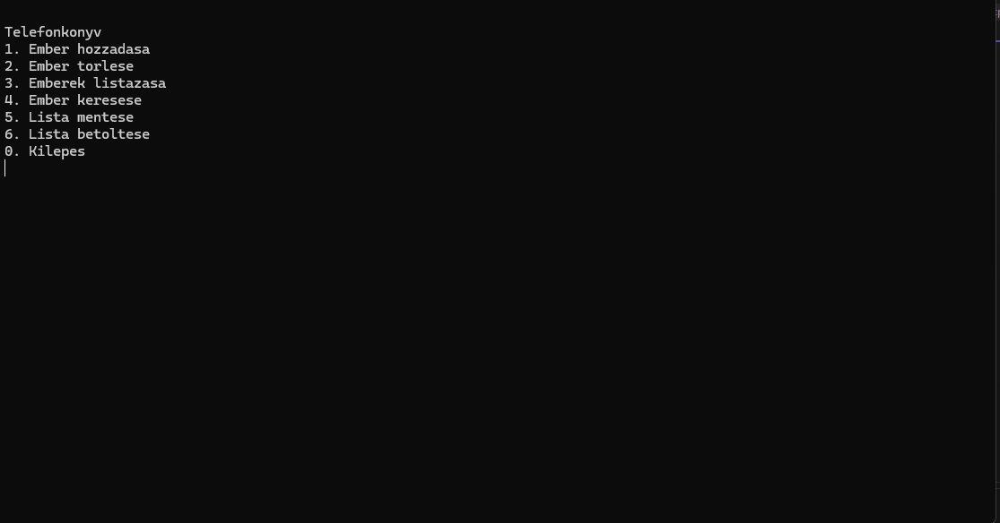
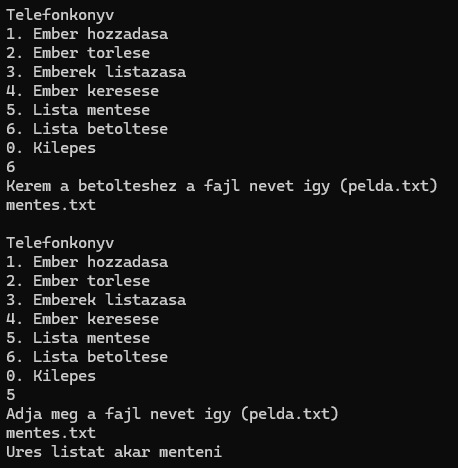
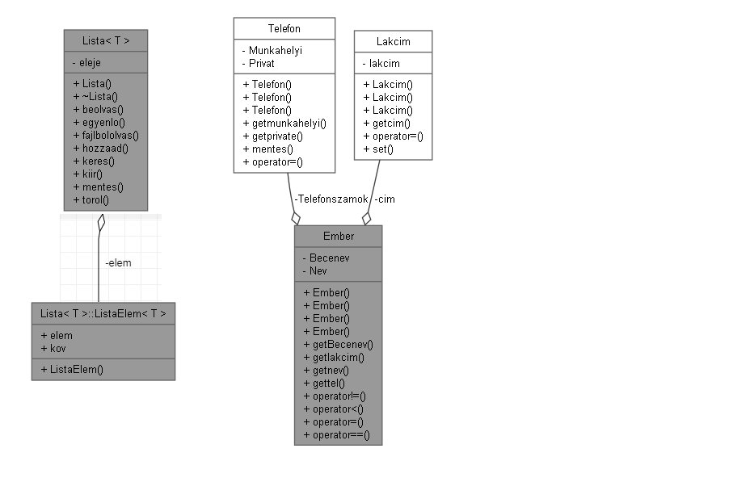

# Telefonkönyv Program (C++)

Egyszerű, sablon alapú, generikus láncolt listát használó telefonkönyv alkalmazás C++ nyelven.

## Funkciók

- Új személy adatainak felvétele (név, becenév, lakcím, privát telefonszám, munkahelyi telefonszám)
- Meglévő személy törlése név alapján
- Személyek listázása ABC sorrendben
- Adatok automatikus betöltése indításkor, mentése kilépéskor
- Hibakezelés és kivételkezelés
- Memóriakezelés MEMTRACE segítségével
- Külön tesztmodul a láncolt lista és kiegészítő függvények ellenőrzésére

## Használt technológiák

- **C++17**
- **Standard Library**: `string`, `sstream`, `cctype`, `fstream`
- **Sablonok (Templates)**: Generikus láncolt lista megvalósítása
- **MEMTRACE**: Memóriaszivárgás ellenőrzés

## Parancsok

- **Adatok felvétele**: Új személy hozzáadása, megadva a szükséges adatokat. (Név kötelező, becenév, lakcím, munkahelyi szám opcionális.)
- **Adatok törlése**: Név megadása alapján egy személy törlése, megerősítéssel.
- **Listázás**: Az összes személy adatainak kiírása névsor szerint.

## Fájlkezelés

- Induláskor a program megkísérli a korábban elmentett adatok betöltését.
- Kilépéskor elmenti az aktuális adatokat fájlba.
- Sikertelen betöltés vagy mentés esetén figyelmeztetést ad.

## Lista osztály funkciói

- Létrehozás
- Megszüntetés
- Elem hozzáadása (rendezett módon név szerint)
- Elem törlése
- Összes elem listázása
- Keresés név alapján
- Összehasonlítás (név alapján)

## Tesztelés

A program mellé egy külön tesztmodul tartozik, amely ellenőrzi:

1. Elem hozzáadását és keresést integer listán.
2. Elem törlését.
3. Fájlba mentést és betöltést integer listával.
4. Lista kiírást karakterlistára.
5. `Ember` osztály operátorainak helyes működését.
6. Segédfüggvények tesztelését (pl. telefonszám ellenőrzés).

## Megvalósítási részletek

- Új elem beszúrása előtt név alapján történő összehasonlítással rendezetten illeszt be.
- A telefonszámok érvényességét külön ellenőrző függvény vizsgálja.
- Hibás adatbevitel esetén hibaüzenetet ad, és új adatot kér.

## Memóriakezelés

- A program MEMTRACE modult használ a dinamikusan foglalt memória helyes kezelésének ellenőrzésére.
- A tesztelések során nem jelentkezett memóriaszivárgás.

---

**Fejlesztő**: Szakács Olivér  
**Tantárgy**: Programozás alapjai 2  

## Képernyőképek

